# Chocolatey Packages

<div align="center">
  <a href="https://github.com/MKAbuMattar/chocolatey-packages/actions/workflows/update.yaml">
    
  </a>
  <a href="https://github.com/MKAbuMattar/chocolatey-packages/actions/workflows/test.yaml">
    
  </a>
  <a href="LICENSE">
    
  </a>
</div>

Source for the [Chocolatey](https://chocolatey.org) packages maintained by
[@MKAbuMattar](https://github.com/MKAbuMattar). Every package here is an
[automatic package](https://docs.chocolatey.org/en-us/create/automatic-packages/). A
scheduled workflow checks upstream for a new version, updates the package, packs it,
pushes it to the Chocolatey Community Repository and creates a GitHub release, one package
at a time. Nobody has to run anything by hand.

## Packages

| Icon                                                                                           | Package                                                  | Version                                                                                                                                                                                            | Downloads                                                                                     | Upstream                                                                                      |
| ---------------------------------------------------------------------------------------------- | -------------------------------------------------------- | -------------------------------------------------------------------------------------------------------------------------------------------------------------------------------------------------- | --------------------------------------------------------------------------------------------- | --------------------------------------------------------------------------------------------- |
| 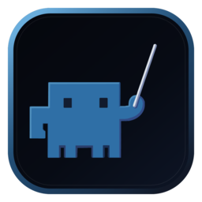       | [agent-orchestrator](automatic/agent-orchestrator)       | [](https://community.chocolatey.org/packages/agent-orchestrator)          |     | [Untrivial-ai/agent-orchestrator](https://github.com/Untrivial-ai/agent-orchestrator)         |
|                    | [alertmanager](automatic/alertmanager)                   | [](https://community.chocolatey.org/packages/alertmanager)                            |           | [prometheus/alertmanager](https://github.com/prometheus/alertmanager)                         |
| 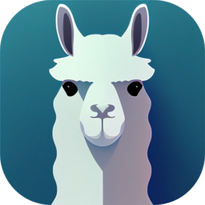             | [alpaca-electron](automatic/alpaca-electron)             | [](https://community.chocolatey.org/packages/alpaca-electron)                   |        | [ItsPi3141/alpaca-electron](https://github.com/ItsPi3141/alpaca-electron)                     |
|                      | [anythingllm](automatic/anythingllm)                     | [](https://community.chocolatey.org/packages/anythingllm)                               |            | [Mintplex-Labs/anything-llm](https://github.com/Mintplex-Labs/anything-llm)                   |
| 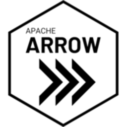 | [arrow-flight-sql-odbc](automatic/arrow-flight-sql-odbc) | [](https://community.chocolatey.org/packages/arrow-flight-sql-odbc) |  | [apache/arrow](https://github.com/apache/arrow)                                               |
|                            | [autoclaw](automatic/autoclaw)                           | [](https://community.chocolatey.org/packages/autoclaw)                                        |               | [autoclaw.z.ai](https://autoclaw.z.ai/)                                                       |
|                              | [bananas](automatic/bananas)                             | [](https://community.chocolatey.org/packages/bananas)                                           |                | [mistweaverco/bananas](https://github.com/mistweaverco/bananas)                               |
|              | [boring-registry](automatic/boring-registry)             | [](https://community.chocolatey.org/packages/boring-registry)                   |        | [boring-registry/boring-registry](https://github.com/boring-registry/boring-registry)         |
|                                    | [buzz](automatic/buzz)                                   | [](https://community.chocolatey.org/packages/buzz)                                                    |                   | [block/buzz](https://github.com/block/buzz)                                                   |
|                          | [cc-switch](automatic/cc-switch)                         | [](https://community.chocolatey.org/packages/cc-switch)                                     |              | [farion1231/cc-switch](https://github.com/farion1231/cc-switch)                               |
|                                | [cdxgen](automatic/cdxgen)                               | [](https://community.chocolatey.org/packages/cdxgen)                                              |                 | [cdxgen/cdxgen](https://github.com/cdxgen/cdxgen)                                             |
|        | [claude-code-router](automatic/claude-code-router)       | [](https://community.chocolatey.org/packages/claude-code-router)          |     | [musistudio/claude-code-router](https://github.com/musistudio/claude-code-router)             |
| 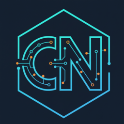                         | [codenomad](automatic/codenomad)                         | [](https://community.chocolatey.org/packages/codenomad)                                     |              | [NeuralNomadsAI/CodeNomad](https://github.com/NeuralNomadsAI/CodeNomad)                       |
| 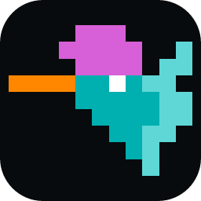                             | [colibri](automatic/colibri)                             | [](https://community.chocolatey.org/packages/colibri)                                           |                | [JustVugg/colibri](https://github.com/JustVugg/colibri)                                       |
| 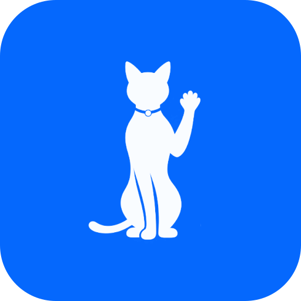                               | [concat](automatic/concat)                               | [](https://community.chocolatey.org/packages/concat)                                              |                 | [jub0t/Concat](https://github.com/jub0t/Concat)                                               |
|                                  | [crush](automatic/crush)                                 | [](https://community.chocolatey.org/packages/crush)                                                 |                  | [charmbracelet/crush](https://github.com/charmbracelet/crush)                                 |
|                            | [dashbeam](automatic/dashbeam)                           | [](https://community.chocolatey.org/packages/dashbeam)                                        |               | [tonyantony300/dashbeam](https://github.com/tonyantony300/dashbeam)                           |
|              | [data-formulator](automatic/data-formulator)             | [](https://community.chocolatey.org/packages/data-formulator)                   |        | [microsoft/data-formulator](https://github.com/microsoft/data-formulator)                     |
|                              | [daytona](automatic/daytona)                             | [](https://community.chocolatey.org/packages/daytona)                                           |                | [daytonaio/daytona](https://github.com/daytonaio/daytona)                                     |
|                      | [debug-skill](automatic/debug-skill)                     | [](https://community.chocolatey.org/packages/debug-skill)                               |            | [AlmogBaku/debug-skill](https://github.com/AlmogBaku/debug-skill)                             |
|                            | [deepchat](automatic/deepchat)                           | [](https://community.chocolatey.org/packages/deepchat)                                        |               | [ThinkInAIXYZ/deepchat](https://github.com/ThinkInAIXYZ/deepchat)                             |
| 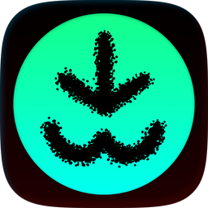                                 | [dlman](automatic/dlman)                                 | [](https://community.chocolatey.org/packages/dlman)                                                 |                  | [novincode/dlman](https://github.com/novincode/dlman)                                         |
| 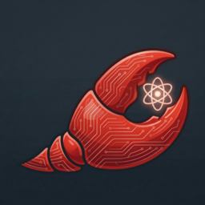                             | [dr-claw](automatic/dr-claw)                             | [](https://community.chocolatey.org/packages/dr-claw)                                           |                | [OpenLAIR/dr-claw](https://github.com/OpenLAIR/dr-claw)                                       |
|                                    | [dyad](automatic/dyad)                                   | [](https://community.chocolatey.org/packages/dyad)                                                    |                   | [dyad-sh/dyad](https://github.com/dyad-sh/dyad)                                               |
|                                  | [e2ecp](automatic/e2ecp)                                 | [](https://community.chocolatey.org/packages/e2ecp)                                                 |                  | [schollz/e2ecp](https://github.com/schollz/e2ecp)                                             |
|                        | [ever-gauzy](automatic/ever-gauzy)                       | [](https://community.chocolatey.org/packages/ever-gauzy)                                  |             | [ever-co/ever-gauzy](https://github.com/ever-co/ever-gauzy)                                   |
|                            | [faceswap](automatic/faceswap)                           | [](https://community.chocolatey.org/packages/faceswap)                                        |               | [deepfakes/faceswap](https://github.com/deepfakes/faceswap)                                   |
|                      | [filebrowser](automatic/filebrowser)                     | [](https://community.chocolatey.org/packages/filebrowser)                               |            | [filebrowser/filebrowser](https://github.com/filebrowser/filebrowser)                         |
|                                    | [flet](automatic/flet)                                   | [](https://community.chocolatey.org/packages/flet)                                                    |                   | [lmstudio.ai](https://lmstudio.ai/)                                                           |
|                  | [flux-operator](automatic/flux-operator)                 | [](https://community.chocolatey.org/packages/flux-operator)                         |          | [controlplaneio-fluxcd/flux-operator](https://github.com/controlplaneio-fluxcd/flux-operator) |
|                  | [fort-firewall](automatic/fort-firewall)                 | [](https://community.chocolatey.org/packages/fort-firewall)                         |          | [tnodir/fort](https://github.com/tnodir/fort)                                                 |
|      | [game-cheats-manager](automatic/game-cheats-manager)     | [](https://community.chocolatey.org/packages/game-cheats-manager)       |    | [dyang886/Game-Cheats-Manager](https://github.com/dyang886/Game-Cheats-Manager)               |
|                          | [genoffice](automatic/genoffice)                         | [](https://community.chocolatey.org/packages/genoffice)                                     |              | [genspark-ai/genoffice](https://github.com/genspark-ai/genoffice)                             |
|                                      | [gfs](automatic/gfs)                                     | [](https://community.chocolatey.org/packages/gfs)                                                       |                    | [Guepard-Corp/gfs](https://github.com/Guepard-Corp/gfs)                                       |
|          | [github-mcp-server](automatic/github-mcp-server)         | [](https://community.chocolatey.org/packages/github-mcp-server)             |      | [github/github-mcp-server](https://github.com/github/github-mcp-server)                       |
|                                | [grepai](automatic/grepai)                               | [](https://community.chocolatey.org/packages/grepai)                                              |                 | [yoanbernabeu/grepai](https://github.com/yoanbernabeu/grepai)                                 |
| 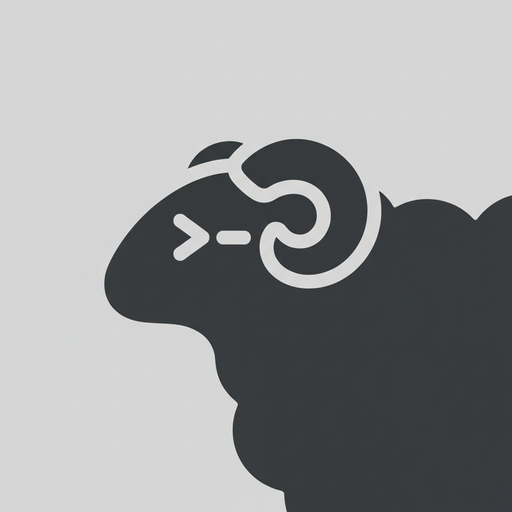                                 | [herdr](automatic/herdr)                                 | [](https://community.chocolatey.org/packages/herdr)                                                 |                  | [lmstudio.ai](https://lmstudio.ai/)                                                           |
|                            | [himalaya](automatic/himalaya)                           | [](https://community.chocolatey.org/packages/himalaya)                                        |               | [pimalaya/himalaya](https://github.com/pimalaya/himalaya)                                     |
|    | [iam-policy-autopilot](automatic/iam-policy-autopilot)   | [](https://community.chocolatey.org/packages/iam-policy-autopilot)    |   | [awslabs/iam-policy-autopilot](https://github.com/awslabs/iam-policy-autopilot)               |
|                        | [impeccable](automatic/impeccable)                       | [](https://community.chocolatey.org/packages/impeccable)                                  |             | [pbakaus/impeccable](https://github.com/pbakaus/impeccable)                                   |
|              | [iroh-dns-server](automatic/iroh-dns-server)             | [](https://community.chocolatey.org/packages/iroh-dns-server)                   |        | [n0-computer/iroh](https://github.com/n0-computer/iroh)                                       |
|                        | [iroh-relay](automatic/iroh-relay)                       | [](https://community.chocolatey.org/packages/iroh-relay)                                  |             | [n0-computer/iroh](https://github.com/n0-computer/iroh)                                       |
|                                      | [iwe](automatic/iwe)                                     | [](https://community.chocolatey.org/packages/iwe)                                                       |                    | [lmstudio.ai](https://lmstudio.ai/)                                                           |
|                                      | [jqp](automatic/jqp)                                     | [](https://community.chocolatey.org/packages/jqp)                                                       |                    | [noahgorstein/jqp](https://github.com/noahgorstein/jqp)                                       |
| 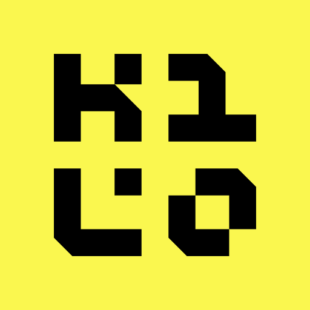                           | [kilocode](automatic/kilocode)                           | [](https://community.chocolatey.org/packages/kilocode)                                        |               | [Kilo-Org/kilocode](https://github.com/Kilo-Org/kilocode)                                     |
| 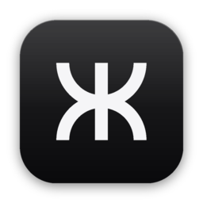                               | [kortix](automatic/kortix)                               | [](https://community.chocolatey.org/packages/kortix)                                              |                 | [kortix-ai/suna](https://github.com/kortix-ai/suna)                                           |
|                    | [kubectl-cnpg](automatic/kubectl-cnpg)                   | [](https://community.chocolatey.org/packages/kubectl-cnpg)                            |           | [cloudnative-pg/cloudnative-pg](https://github.com/cloudnative-pg/cloudnative-pg)             |
|                                                                                                | [kytyps5](automatic/kytyps5)                             | [](https://community.chocolatey.org/packages/kytyps5)                                           |                | [KytyPS5/KytyPS5](https://github.com/KytyPS5/KytyPS5)                                         |
|                            | [lean-ctx](automatic/lean-ctx)                           | [](https://community.chocolatey.org/packages/lean-ctx)                                        |               | [yvgude/lean-ctx](https://github.com/yvgude/lean-ctx)                                         |
|                        | [litestream](automatic/litestream)                       | [](https://community.chocolatey.org/packages/litestream)                                  |             | [benbjohnson/litestream](https://github.com/benbjohnson/litestream)                           |
| 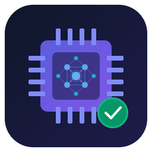                               | [llmfit](automatic/llmfit)                               | [](https://community.chocolatey.org/packages/llmfit)                                              |                 | [AlexsJones/llmfit](https://github.com/AlexsJones/llmfit)                                     |
|                                    | [llrt](automatic/llrt)                                   | [](https://community.chocolatey.org/packages/llrt)                                                    |                   | [awslabs/llrt](https://github.com/awslabs/llrt)                                               |
|                            | [lmstudio](automatic/lmstudio)                           | [](https://community.chocolatey.org/packages/lmstudio)                                        |               | [lmstudio.ai](https://lmstudio.ai/)                                                           |
|              | [lmstudio-bionic](automatic/lmstudio-bionic)             | [](https://community.chocolatey.org/packages/lmstudio-bionic)                   |        | [lmstudio.ai](https://lmstudio.ai/)                                                           |
|                              | [lobehub](automatic/lobehub)                             | [](https://community.chocolatey.org/packages/lobehub)                                           |                | [lobehub/lobehub](https://github.com/lobehub/lobehub)                                         |
|                                  | [manta](automatic/manta)                                 | [](https://community.chocolatey.org/packages/manta)                                                 |                  | [lmstudio.ai](https://lmstudio.ai/)                                                           |
|                              | [meetily](automatic/meetily)                             | [](https://community.chocolatey.org/packages/meetily)                                           |                | [Zackriya-Solutions/meetily](https://github.com/Zackriya-Solutions/meetily)                   |
|                                  | [memos](automatic/memos)                                 | [](https://community.chocolatey.org/packages/memos)                                                 |                  | [usememos/memos](https://github.com/usememos/memos)                                           |
| 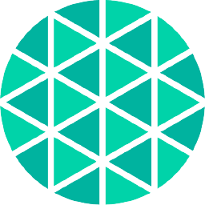                       | [mesheryctl](automatic/mesheryctl)                       | [](https://community.chocolatey.org/packages/mesheryctl)                                  |             | [meshery/meshery](https://github.com/meshery/meshery)                                         |
|                            | [mindwalk](automatic/mindwalk)                           | [](https://community.chocolatey.org/packages/mindwalk)                                        |               | [cosmtrek/mindwalk](https://github.com/cosmtrek/mindwalk)                                     |
|                                | [ms-apm](automatic/ms-apm)                               | [](https://community.chocolatey.org/packages/ms-apm)                                              |                 | [lmstudio.ai](https://lmstudio.ai/)                                                           |
|                    | [ms-coreutils](automatic/ms-coreutils)                   | [](https://community.chocolatey.org/packages/ms-coreutils)                            |           | [lmstudio.ai](https://lmstudio.ai/)                                                           |
|                              | [neohtop](automatic/neohtop)                             | [](https://community.chocolatey.org/packages/neohtop)                                           |                | [Abdenasser/neohtop](https://github.com/Abdenasser/neohtop)                                   |
|                            | [nginx-ui](automatic/nginx-ui)                           | [](https://community.chocolatey.org/packages/nginx-ui)                                        |               | [0xJacky/nginx-ui](https://github.com/0xJacky/nginx-ui)                                       |
| 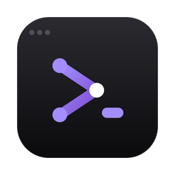                           | [nodeterm](automatic/nodeterm)                           | [](https://community.chocolatey.org/packages/nodeterm)                                        |               | [eneskirca/nodeterm](https://github.com/eneskirca/nodeterm)                                   |
|                                      | [nub](automatic/nub)                                     | [](https://community.chocolatey.org/packages/nub)                                                       |                    | [nubjs/nub](https://github.com/nubjs/nub)                                                     |
|                    | [numbat-agent](automatic/numbat-agent)                   | [](https://community.chocolatey.org/packages/numbat-agent)                            |           | [perplexityai/numbat](https://github.com/perplexityai/numbat)                                 |
|                              | [octobot](automatic/octobot)                             | [](https://community.chocolatey.org/packages/octobot)                                           |                | [Drakkar-Software/OctoBot](https://github.com/Drakkar-Software/OctoBot)                       |
|                            | [oh-my-pi](automatic/oh-my-pi)                           | [](https://community.chocolatey.org/packages/oh-my-pi)                                        |               | [can1357/oh-my-pi](https://github.com/can1357/oh-my-pi)                                       |
|                              | [omnictl](automatic/omnictl)                             | [](https://community.chocolatey.org/packages/omnictl)                                           |                | [siderolabs/omni](https://github.com/siderolabs/omni)                                         |
|                                | [onlook](automatic/onlook)                               | [](https://community.chocolatey.org/packages/onlook)                                              |                 | [onlook-dev/onlook](https://github.com/onlook-dev/onlook)                                     |
|            | [open-interpreter](automatic/open-interpreter)           | [](https://community.chocolatey.org/packages/open-interpreter)                |       | [openinterpreter/openinterpreter](https://github.com/openinterpreter/openinterpreter)         |
|                | [open-knowledge](automatic/open-knowledge)               | [](https://community.chocolatey.org/packages/open-knowledge)                      |         | [inkeep/open-knowledge](https://github.com/inkeep/open-knowledge)                             |
|              | [open-pdf-studio](automatic/open-pdf-studio)             | [](https://community.chocolatey.org/packages/open-pdf-studio)                   |        | [OpenAEC-Foundation/open-pdf-studio](https://github.com/OpenAEC-Foundation/open-pdf-studio)   |
| 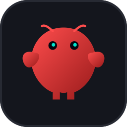       | [openclaw-companion](automatic/openclaw-companion)       | [](https://community.chocolatey.org/packages/openclaw-companion)          |     | [openclaw/openclaw](https://github.com/openclaw/openclaw)                                     |
|                | [opencodereview](automatic/opencodereview)               | [](https://community.chocolatey.org/packages/opencodereview)                      |         | [alibaba/open-code-review](https://github.com/alibaba/open-code-review)                       |
|              | [openfootmanager](automatic/openfootmanager)             | [](https://community.chocolatey.org/packages/openfootmanager)                   |        | [lmstudio.ai](https://lmstudio.ai/)                                                           |
| 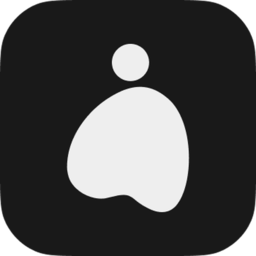                         | [openhuman](automatic/openhuman)                         | [](https://community.chocolatey.org/packages/openhuman)                                     |              | [tinyhumansai/openhuman](https://github.com/tinyhumansai/openhuman)                           |
|                    | [openresearch](automatic/openresearch)                   | [](https://community.chocolatey.org/packages/openresearch)                            |           | [alphaXiv/OpenResearch](https://github.com/alphaXiv/OpenResearch)                             |
|                            | [openship](automatic/openship)                           | [](https://community.chocolatey.org/packages/openship)                                        |               | [lmstudio.ai](https://lmstudio.ai/)                                                           |
|                              | [opensre](automatic/opensre)                             | [](https://community.chocolatey.org/packages/opensre)                                           |                | [Tracer-Cloud/opensre](https://github.com/Tracer-Cloud/opensre)                               |
|                            | [openwork](automatic/openwork)                           | [](https://community.chocolatey.org/packages/openwork)                                        |               | [different-ai/openwork](https://github.com/different-ai/openwork)                             |
|                        | [openworker](automatic/openworker)                       | [](https://community.chocolatey.org/packages/openworker)                                  |             | [andrewyng/openworker](https://github.com/andrewyng/openworker)                               |
|                          | [ouroboros](automatic/ouroboros)                         | [](https://community.chocolatey.org/packages/ouroboros)                                     |              | [Q00/ouroboros](https://github.com/Q00/ouroboros)                                             |
| 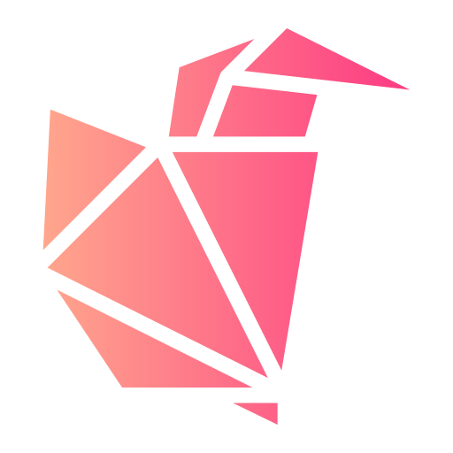                           | [p2p-kiwi](automatic/p2p-kiwi)                           | [](https://community.chocolatey.org/packages/p2p-kiwi)                                        |               | [dont-be-evil-company/p2p.kiwi](https://github.com/dont-be-evil-company/p2p.kiwi)             |
|                                | [patent](automatic/patent)                               | [](https://community.chocolatey.org/packages/patent)                                              |                 | [r14dd/patent](https://github.com/r14dd/patent)                                               |
|                          | [pdf-brain](automatic/pdf-brain)                         | [](https://community.chocolatey.org/packages/pdf-brain)                                     |              | [lmstudio.ai](https://lmstudio.ai/)                                                           |
|                  | [pentesterflow](automatic/pentesterflow)                 | [](https://community.chocolatey.org/packages/pentesterflow)                         |          | [PentesterFlow/agent](https://github.com/PentesterFlow/agent)                                 |
|                                        | [pi](automatic/pi)                                       | [](https://community.chocolatey.org/packages/pi)                                                          |                     | [earendil-works/pi](https://github.com/earendil-works/pi)                                     |
|                          | [pilotdeck](automatic/pilotdeck)                         | [](https://community.chocolatey.org/packages/pilotdeck)                                     |              | [OpenBMB/PilotDeck](https://github.com/OpenBMB/PilotDeck)                                     |
|                                    | [pixi](automatic/pixi)                                   | [](https://community.chocolatey.org/packages/pixi)                                                    |                   | [prefix-dev/pixi](https://github.com/prefix-dev/pixi)                                         |
|                                      | [pkl](automatic/pkl)                                     | [](https://community.chocolatey.org/packages/pkl)                                                       |                    | [apple/pkl](https://github.com/apple/pkl)                                                     |
|                      | [posthog-cli](automatic/posthog-cli)                     | [](https://community.chocolatey.org/packages/posthog-cli)                               |            | [PostHog/posthog](https://github.com/PostHog/posthog)                                         |
|                        | [qodo-cover](automatic/qodo-cover)                       | [](https://community.chocolatey.org/packages/qodo-cover)                                  |             | [qodo-ai/qodo-cover](https://github.com/qodo-ai/qodo-cover)                                   |
|            | [qwen-audio-agent](automatic/qwen-audio-agent)           | [](https://community.chocolatey.org/packages/qwen-audio-agent)                |       | [QwenAudio/qwen-audio-agent](https://github.com/QwenAudio/qwen-audio-agent)                   |
|                          | [qwen-code](automatic/qwen-code)                         | [](https://community.chocolatey.org/packages/qwen-code)                                     |              | [QwenLM/qwen-code](https://github.com/QwenLM/qwen-code)                                       |
| 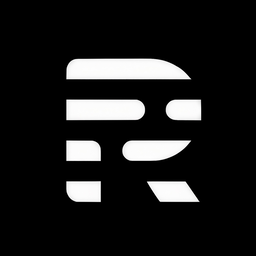             | [rescript-editor](automatic/rescript-editor)             | [](https://community.chocolatey.org/packages/rescript-editor)                   |        | [wassgha/rescript](https://github.com/wassgha/rescript)                                       |
|                                      | [rtk](automatic/rtk)                                     | [](https://community.chocolatey.org/packages/rtk)                                                       |                    | [rtk-ai/rtk](https://github.com/rtk-ai/rtk)                                                   |
|                        | [servoshell](automatic/servoshell)                       | [](https://community.chocolatey.org/packages/servoshell)                                  |             | [servo/servo](https://github.com/servo/servo)                                                 |
|                        | [sql-studio](automatic/sql-studio)                       | [](https://community.chocolatey.org/packages/sql-studio)                                  |             | [lmstudio.ai](https://lmstudio.ai/)                                                           |
|                                  | [squad](automatic/squad)                                 | [](https://community.chocolatey.org/packages/squad)                                                 |                  | [mco-org/squad](https://github.com/mco-org/squad)                                             |
|                                  | [strix](automatic/strix)                                 | [](https://community.chocolatey.org/packages/strix)                                                 |                  | [usestrix/strix](https://github.com/usestrix/strix)                                           |
| 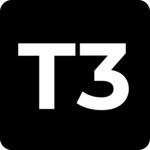                             | [t3-code](automatic/t3-code)                             | [](https://community.chocolatey.org/packages/t3-code)                                           |                | [pingdotgg/t3code](https://github.com/pingdotgg/t3code)                                       |
|                            | [tailspin](automatic/tailspin)                           | [](https://community.chocolatey.org/packages/tailspin)                                        |               | [bensadeh/tailspin](https://github.com/bensadeh/tailspin)                                     |
|                                  | [terax](automatic/terax)                                 | [](https://community.chocolatey.org/packages/terax)                                                 |                  | [crynta/terax-ai](https://github.com/crynta/terax-ai)                                         |
| 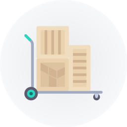                         | [terralist](automatic/terralist)                         | [](https://community.chocolatey.org/packages/terralist)                                     |              | [terralist/terralist](https://github.com/terralist/terralist)                                 |
|                            | [tiny-rdm](automatic/tiny-rdm)                           | [](https://community.chocolatey.org/packages/tiny-rdm)                                        |               | [tiny-craft/tiny-rdm](https://github.com/tiny-craft/tiny-rdm)                                 |
|                              | [traccar](automatic/traccar)                             | [](https://community.chocolatey.org/packages/traccar)                                           |                | [traccar/traccar](https://github.com/traccar/traccar)                                         |
|                                  | [tuios](automatic/tuios)                                 | [](https://community.chocolatey.org/packages/tuios)                                                 |                  | [Gaurav-Gosain/tuios](https://github.com/Gaurav-Gosain/tuios)                                 |
|                                      | [txm](automatic/txm)                                     | [](https://community.chocolatey.org/packages/txm)                                                       |                    | [thatmagicalcat/txm](https://github.com/thatmagicalcat/txm)                                   |
|                              | [vaults3](automatic/vaults3)                             | [](https://community.chocolatey.org/packages/vaults3)                                           |                | [Kodiqa-Solutions/VaultS3](https://github.com/Kodiqa-Solutions/VaultS3)                       |
|                  | [vercel-native](automatic/vercel-native)                 | [](https://community.chocolatey.org/packages/vercel-native)                         |          | [vercel-labs/native](https://github.com/vercel-labs/native)                                   |
|                      | [voicestudio](automatic/voicestudio)                     | [](https://community.chocolatey.org/packages/voicestudio)                               |            | [debpalash/VoiceStudio](https://github.com/debpalash/VoiceStudio)                             |
|                      | [whisper-cpp](automatic/whisper-cpp)                     | [](https://community.chocolatey.org/packages/whisper-cpp)                               |            | [ggml-org/whisper.cpp](https://github.com/ggml-org/whisper.cpp)                               |
|                          | [whosthere](automatic/whosthere)                         | [](https://community.chocolatey.org/packages/whosthere)                                     |              | [ramonvermeulen/whosthere](https://github.com/ramonvermeulen/whosthere)                       |
|                                | [winapp](automatic/winapp)                               | [](https://community.chocolatey.org/packages/winapp)                                              |                 | [microsoft/winappCli](https://github.com/microsoft/winappCli)                                 |
|                                  | [witsy](automatic/witsy)                                 | [](https://community.chocolatey.org/packages/witsy)                                                 |                  | [Kochava-Studios/witsy](https://github.com/Kochava-Studios/witsy)                             |
| 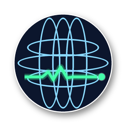                   | [worldmonitor](automatic/worldmonitor)                   | [](https://community.chocolatey.org/packages/worldmonitor)                            |           | [koala73/worldmonitor](https://github.com/koala73/worldmonitor)                               |
| 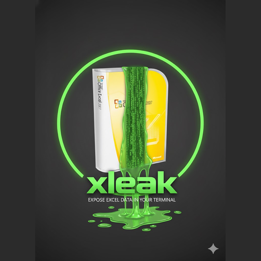                                 | [xleak](automatic/xleak)                                 | [](https://community.chocolatey.org/packages/xleak)                                                 |                  | [bgreenwell/xleak](https://github.com/bgreenwell/xleak)                                       |
|                                | [ytsage](automatic/ytsage)                               | [](https://community.chocolatey.org/packages/ytsage)                                              |                 | [oop7/YTSage](https://github.com/oop7/YTSage)                                                 |

## Layout

```
automatic/<id>/
  <id>.nuspec               package metadata (version and description are generated)
  update.ps1                how to find the latest version, URL and what to replace
  tools/chocolateyInstall.ps1
  README.md                 the package description, and the source for the nuspec
icons/                      package icons, served over jsDelivr instead of hotlinked
au_shared.psm1              the GitHub release lookup every update.ps1 shares
update_all.ps1              the updater entry point used by CI and locally
sync_readme.ps1             copies each README into its nuspec <description>
```

Folder name, nuspec file name and package id must match, because that is how
[Chocolatey AU](https://github.com/chocolatey-community/chocolatey-au) finds packages.

No package carries a binary. Each one downloads the official upstream build at install
time and checks it against a SHA256 recorded in `chocolateyInstall.ps1`.

### Package README structure

Every package README uses the same headings, in this order:

```
# <Name> Chocolatey Package
## Install            the choco command, how the package gets the software, version pinning
## What is <Name>?    what the software does, in the upstream project's own terms
## Usage              only when the package installs a named command
## Upgrade
## Uninstall
## Links              website, source, docs, releases, issues, Chocolatey page, package source
## License            this package is MIT, the software keeps its own
```

A package may add its own sections after `What is <Name>?`, as `lmstudio`, `pixi` and
`witsy` do.

Write the description once, in `README.md`. `sync_readme.ps1` copies it into the nuspec,
minus the H1, so the Chocolatey package page and this repository cannot disagree.

## How the automation works

`update.yaml` runs hourly on a Windows runner:

1. `sync_readme.ps1` refreshes every nuspec description from its README.
2. `update_all.ps1` calls the `update.ps1` of every package in `automatic/`.
3. Each `update.ps1` reports the latest upstream version and download URL.
4. AU skips the package when its nuspec already records that version.
5. Otherwise it downloads the installer, computes the SHA256, rewrites the nuspec version,
   the install script URL and checksum and the release notes, then runs `choco pack`.
6. The new `.nupkg` is pushed to the community feed, the changed files are committed back
   here (one commit per package) and a GitHub release is created with the `.nupkg` attached.
7. The run report is published as the workflow summary.

### Updaters

Every `update.ps1` imports `au_shared.psm1`, so a package states only what is specific
to it. The common case is one call:

```powershell
function global:au_SearchReplace { Get-AuSearchReplace }

function global:au_GetLatest {
  Get-GitHubLatest -Repo $repo -Asset 'crush_{version}_Windows_x86_64.zip'
}
```

`{version}` and `{tag}` in `-Asset` are filled in from the release that was found. Where
upstream is more awkward, the same call takes `-AssetPattern` (file names that do not
track the tag), `-TagPrefix` (monorepos that tag several components), `-TagPattern` and
`-RequireAsset` (releases published without the Windows build). The few packages that
need something else, such as a version built from the release date, assemble the hashtable
from the smaller helpers in the module: `Get-GitHubRelease`, `Get-VersionFromTag`,
`Get-GitHubMatchingAsset`, `Get-GitHubAssetUrl` and `Get-GitHubReleaseNotesUrl`.

Get-Help works on all of them: `Import-Module .\au_shared.psm1; Get-Help Get-GitHubLatest -Full`.

`test.yaml` runs on every pull request. It checks that each nuspec description still
matches its README, then rebuilds every package with `-Force` and pushes nothing. A dead
download URL, a broken `update.ps1`, an invalid nuspec or a stale description fails the PR.

### Secrets

| Secret          | Used for                                                                 |
| --------------- | ------------------------------------------------------------------------ |
| `CHOCO_API_KEY` | pushing packages to the Chocolatey Community Repository                  |
| `GITHUB_TOKEN`  | commits, GitHub releases, GitHub API rate limit (provided automatically) |

Only `CHOCO_API_KEY` has to be set, under **Settings > Secrets and variables > Actions**.
Workflow permissions must allow pushing: **Settings > Actions > General > Workflow
permissions > Read and write**.

## After a push: moderation

A successful push does not mean a package is live. Every version enters moderation on the
community repository and passes two automated gates before a human reviewer sees it.

| Gate         | What it checks                                                                                     | Where the result is                 |
| ------------ | -------------------------------------------------------------------------------------------------- | ----------------------------------- |
| Validation   | nuspec metadata, and whether the package ships binaries without a LICENSE.txt and VERIFICATION.txt | review comments on the package page |
| Verification | a real `choco install` and `choco uninstall` in a clean VM                                         | the linked choco-bot gist           |

Both results are public. To see what a version is doing:

```
https://community.chocolatey.org/packages/<id>/<version>
```

To list the approved versions of a package, with their status:

```
https://community.chocolatey.org/api/v2/Packages()?$filter=Id%20eq%20'<id>'
```

That feed only carries approved versions. A package that returns nothing has never had a
version approved, and the review comments on the package page say why.

A version that fails has to be fixed and pushed again **at the same version number**. The
hourly workflow will not do that, because it only pushes when upstream ships something
new. Republish it by hand from the package folder.

## Running it locally

Needs Windows, PowerShell 5+ and Chocolatey.

```powershell
choco install chocolatey-au --yes
copy update_vars_default.ps1 update_vars.ps1   # then fill in the keys
.\update_all.ps1                # update everything that has a new version
.\update_all.ps1 -Name pixi     # only one package
.\update_all.ps1 -Force         # rebuild everything, push nothing
.\sync_readme.ps1               # regenerate nuspec descriptions from the READMEs
.\sync_readme.ps1 -Check        # report drift without writing, as CI does
```

Publish a single package by hand from its folder:

```powershell
cd automatic/pixi
.\update.ps1
choco push pixi.<version>.nupkg --source https://push.chocolatey.org/
```

## Adding a package

1. `mkdir automatic/<id>` with `<id>.nuspec`, `tools/chocolateyInstall.ps1`, `README.md`.
2. Add the icon as `icons/<id>.png` (128px or larger) and point `iconUrl` at
   `https://cdn.jsdelivr.net/gh/MKAbuMattar/chocolatey-packages@main/icons/<id>.png`.
3. Copy the closest existing `README.md` and keep its headings. Copy the closest existing
   `update.ps1` and adjust the upstream lookup, which for a GitHub release is a single
   `Get-GitHubLatest` call (see [Updaters](#updaters)).
4. Run `.\sync_readme.ps1 -Name <id>` to fill in the nuspec description.
5. Test with `.\update_all.ps1 -Name <id> -Force`, then open a pull request.

Package requirements follow the
[Chocolatey packaging documentation](https://docs.chocolatey.org/en-us/create/create-packages/):
lowercase id, sha256 checksums, no software redistributed inside the package.

## License

[MIT](LICENSE) for the packaging code in this repository. The packaged software keeps its
own license, linked from each package's `licenseUrl`.
